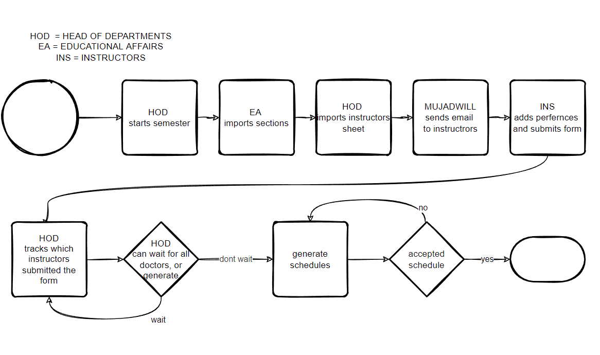

# Domain
Every organization faces planning problems: providing products or services with a limited set of
constrained resources (employees, assets, time and money). With the help of AI, we can optimize
such planning to do more business with less resources. This is known as Constraint Satisfaction
Programming. Currently Mujadwill scope is to automate the assignment of instructors to courses
using optimization algorithm to get most optimal result. Our future development plan will also
include the ability to automate the sections and courses schedule.

# Scope and Problem Definition
The overall problem is a resource allocation problem. In our case, it is specifically around the
assignment of instructors to the available course sections in a way that meets their preferences and
the department’s needs.
## We can divide the overall problem into two stages:
1. Stage 1: Creation of students’ schedule:
   - The educational affairs officer works with the Deanship of Admission & Registration to
create a schedule with the courses, sections, labs, and rooms for all the departments,
without assigning instructors. The focus in this stage is the students and their needs.
1. Stage 2: Creation of instructors’ schedule:
   -  First: Department receives the schedule created from the previous stage for the next
semester from the Educational affairs officer. The Head of the department first checks
if the sum of instructors hours will be able to accommodate the scheduled total hours
received from the Educational affairs officer. If the instructors hours are sufficient, the
head of the department proceeds to the next step. If not, then he must decide whether
to assign overtime hours to department instructors or bring a contracted instructor.
   - Second: Instructors give the head of the department their preferences on what courses
they would like to teach, as well as time and day preferences. After that, The Head of the
Department assigns each section an instructor, keeping in mind their preferences, and
without time conflicts, with minimum break hours, and not exceeding each instructor’s
degree hours, while trying to balance course load between the instructors.
In this work, we present Mujadwill. The focus of our tool will be on stage 2, i.e, the creation
of instructors schedules. It will mainly help the head of the department, by reducing the time and
effort that goes into assigning instructors to sections. Additionally, it will serve instructors because
it will provide the most optimal solution based on their preferences.

# flow chart example

